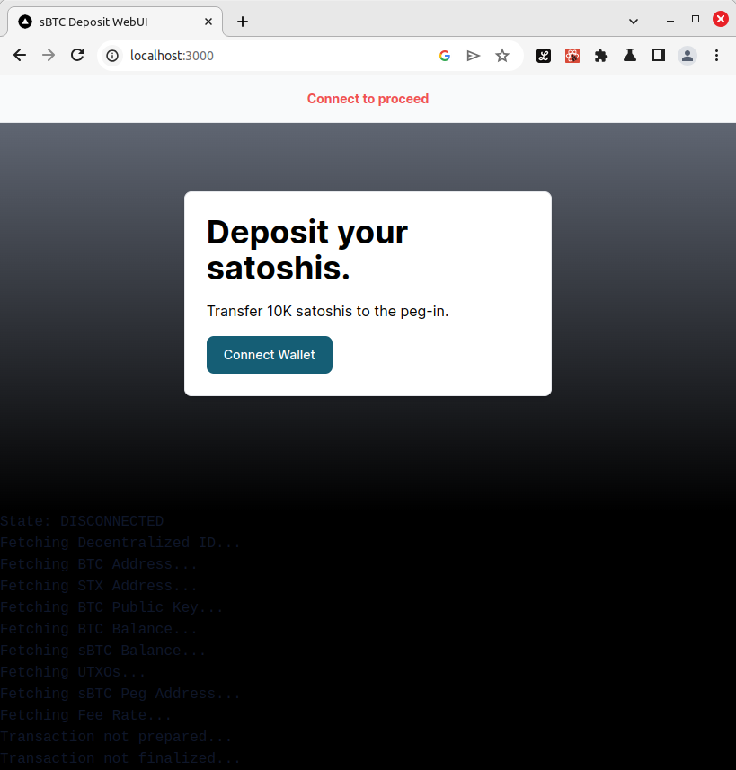
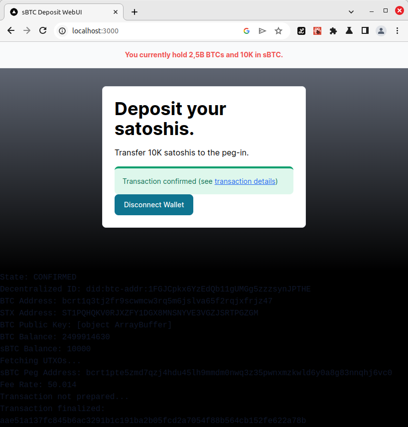

# Web Interace to deposit sBTC

This interace has been developed within the sBTC Developer Release Program.

## Usage

Start your local development servers and then simply run `yarn dev`.

## Screenshots

## License
[GPL-3.0-or-later](./LICENSES/GPL-3.0-or-later.txt)
